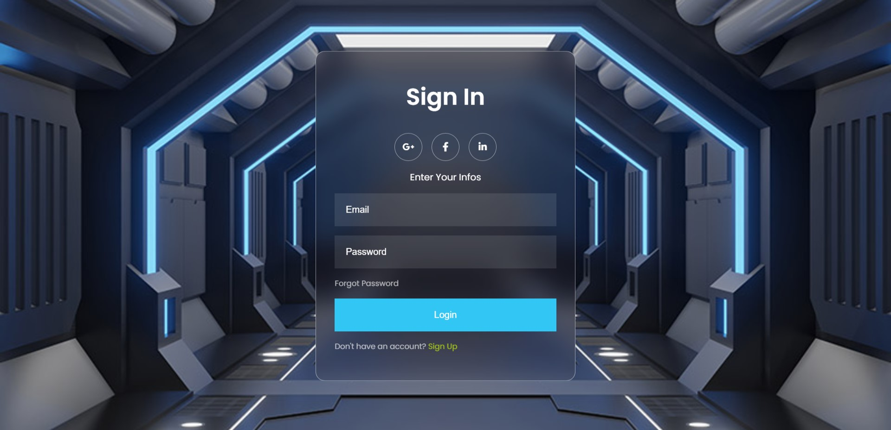
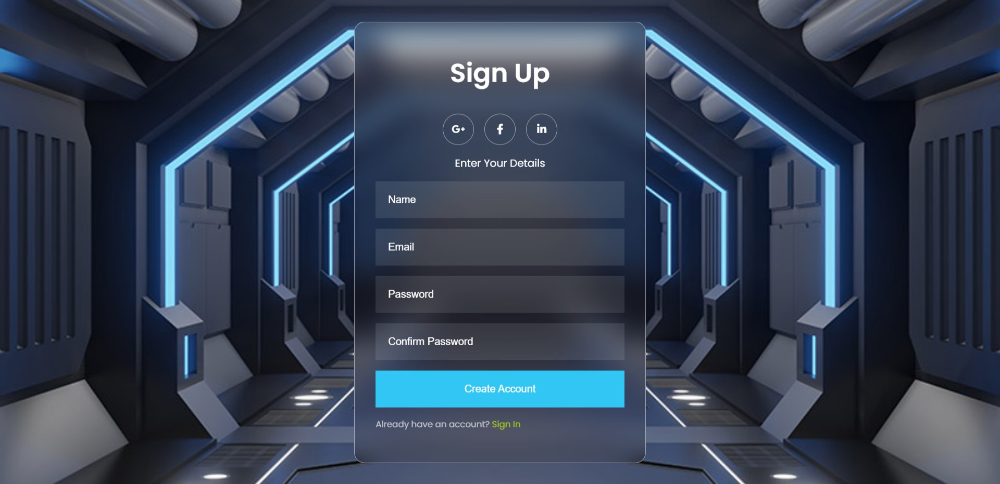

  
  

# 👩🏼‍💻 Login-Registration-Form-Animate

 🔓 ANIMATED Glassmorphism Login & Registration Form using Only HTML & CSS. Or a Sign In & Sign Up Form animation with HTML and CSS. Use a simple trick that shows or hide a form depending on the state of a checkbox.🔒

 Languages:
   ----------
  - HTML 5
  - CSS 3

  # :eyes: Let me show you :  https://sarah-jpro.github.io/Login-Registration-Form-Animate/

   

 
 
